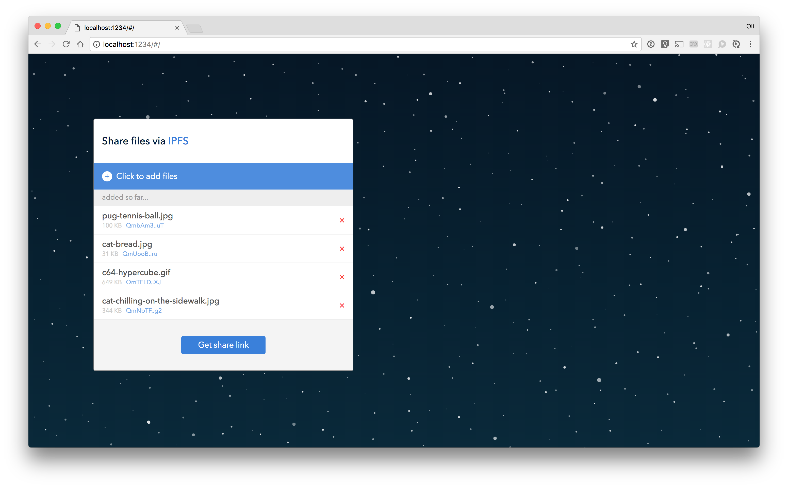
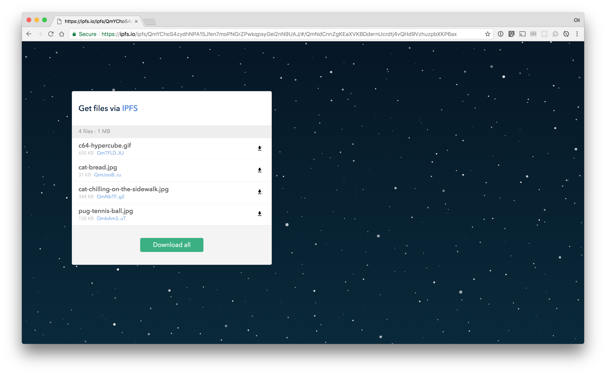

# Share via IPFS

> Share files with friends over IPFS

| Add files | Get files |
|-----------|-----------|
|  |  |

## Getting started

Ensure you have at least

- node@8
- npm@5

Then clone this repo, and install the dependencies

```
npm install
```

**For developing** you can get a [parcel] powered, live-reloading dev-version going with:

```sh
npm start
```

**For production** you can get an optimised build in the project `./dist` directory with:

```
npm run build
```

**To deploy to ipfs** run the build, ensure your local ipfs deamon is running, then:

```
npm run deploy
```

that'll add the dist dir to your local ipfs repo, and print the gateway url for that build.

## Contribute

Feel free to dive in! [Open an issue](https://github.com/tableflip/share-via-ipfs/issues/new) or submit PRs.

## License

[MIT](LICENSE) © Oli Evans
